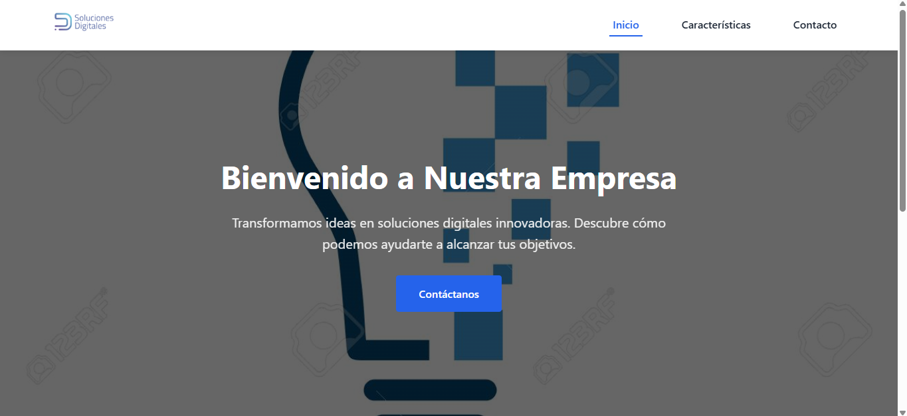
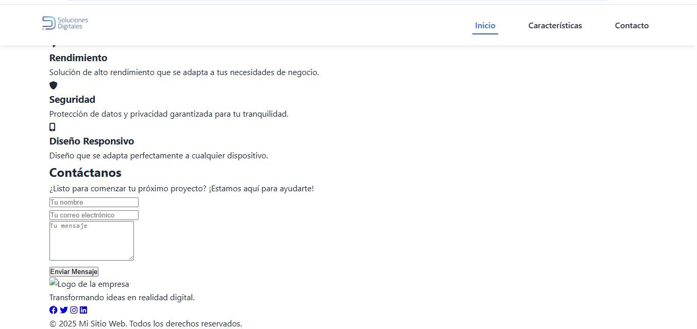

# 🚀 Mi Sitio Web

Bienvenido al repositorio de nuestro sitio web profesional. Este proyecto es una landing page moderna y receptiva diseñada para mostrar los servicios de nuestra empresa.

## 📸 Capturas de Pantalla

### Inicio - Vista Principal

*Figura 1: Página principal con el encabezado, logo y menú de navegación.*

### Características - Sección de Servicios

*Figura 2: Sección que destaca las principales características y servicios del sitio web.*

## 🛠️ Características

- ✅ Diseño completamente responsivo
- ✅ Navegación suave entre secciones
- ✅ Formulario de contacto funcional
- ✅ Optimizado para SEO
- ✅ Carga rápida

## 🚀 Cómo Empezar

1. Clona el repositorio:
   ```bash
   git clone [URL_DEL_REPOSITORIO]
   ```
2. Abre `index.html` en tu navegador
3. ¡Listo! El sitio debería estar funcionando localmente

## 📁 Estructura del Proyecto

```
proyecto/
├── index.html         # Página principal
├── css/              # Estilos CSS
│   └── style.css
├── img/              # Imágenes del sitio
├── js/               # Archivos JavaScript (si los hay)
└── screenshots/      # Capturas de pantalla
```

## ✨ Autores

### Equipo de Desarrollo

<table>
  <tr>
    <td align="center">
      <a href="#">
        <br />
        <sub><b>Caba Jimenez Yuri Maritza</b></sub>
      </a>
    </td>
    <td align="center">
      <a href="#">
        <br />
        <sub><b>Eras Santos Elvis Mateo</b></sub>
      </a>
    </td>
  </tr>
  <tr>
    <td align="center">
      <a href="#">
        <br />
        <sub><b>Jimenez Ayala Oscar Orlando</b></sub>
      </a>
    </td>
    <td align="center">
      <a href="#">
        <br />
        <sub><b>Montaguano Quillupangui Erika Tatiana</b></sub>
      </a>
    </td>
  </tr>
</table>

## 📄 Licencia

Este proyecto está bajo la Licencia MIT. Ver el archivo `LICENSE` para más detalles.

## 🙏 Agradecimientos

- [Font Awesome](https://fontawesome.com/) por los increíbles iconos
- A todos los contribuyentes que han ayudado a mejorar este proyecto

---

<div align="center">
  Hecho con ❤️ por Caba, Eras, Jiménez y Montaguano
</div>
